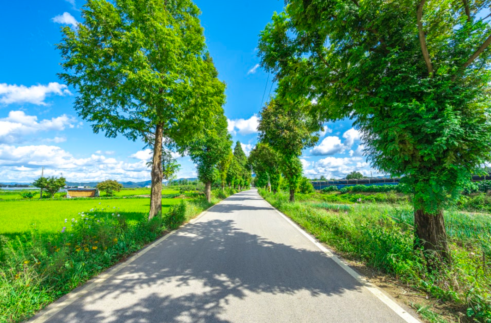
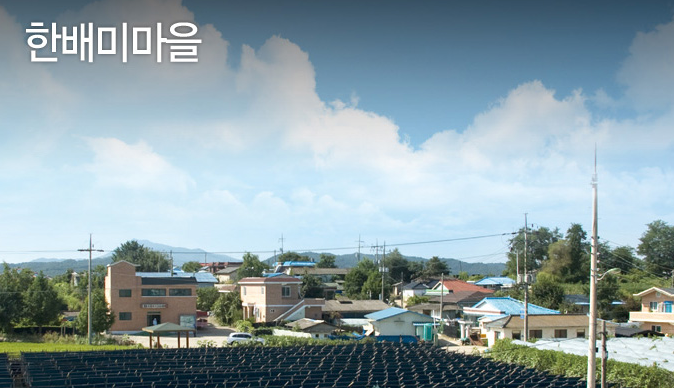
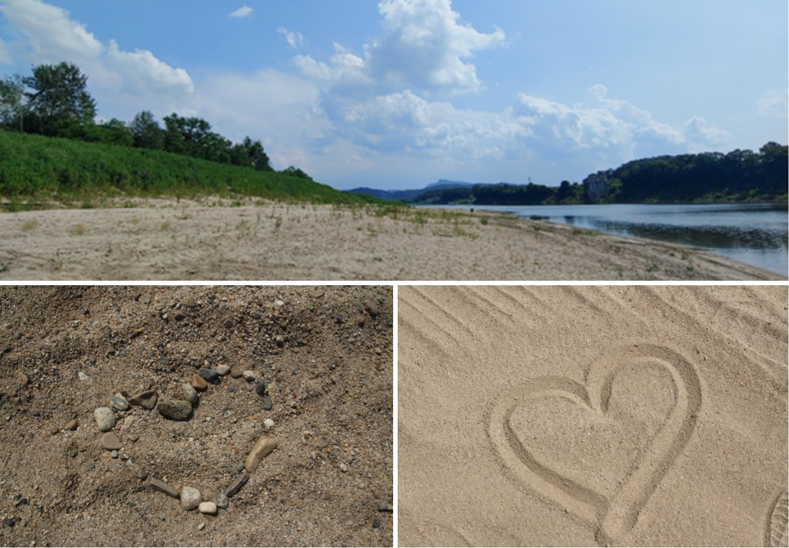

# 한배미마을 — 경기 파주시 주월리 마을 홈페이지

경기도 파주시 주월리 **한배미마을**의 공식 홈페이지.
마을을 방문객에게 소개하고, 체험·숙박 예약과 문의까지 한 곳에서 잇는 정적 웹사이트다.

🔗 **배포:** Netlify

  

## 배경 · 목적
실제 마을을 위한 서비스. 방문객이 체험 프로그램·숙박·오시는 길을 한눈에 보고, 예약·문의까지 바로 할 수 있도록 가볍고 빠른 정적 사이트로 구성했다.

## 구성
| 페이지 | 역할 |
|---|---|
| `index.html` | 메인 · 마을 소개 |
| `village.html` | 마을 이야기 |
| `experience.html` | 체험 프로그램 |
| `stay.html` | 숙박 안내 |
| `booking.html` | 예약 |
| `inquiry.html` | 문의 |
| `notice.html` · `notice-admin.html` | 공지 · 공지 관리 |
| `directions.html` | 오시는 길 |
| `login.html` | 로그인 |

## 기술
- HTML · CSS · JavaScript 멀티페이지
- 예약 / 문의 / 공지 폼 로직 (`js/`)
- SEO: `robots.txt` · `sitemap.xml`
- Netlify 자동 배포

## 갤러리

  
  

## 의의
기술을 실제 사용자·현장 문제에 붙여 **끝까지 배포·운영**한 경험. 화려함보다 "정말 쓰이는 것"을 만드는 데 집중했다.
